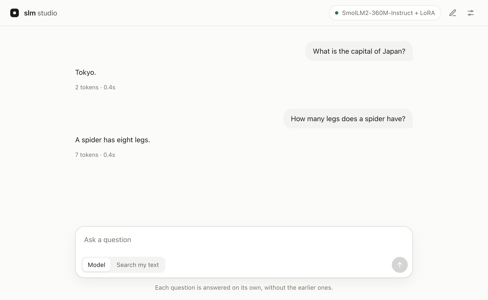

# slm project

this is a small language model i'm building from scratch. it's a decoder-only transformer that reads raw bytes instead of subword tokens, with a 2048-byte context window and size presets that go from a tiny demo model up to about 500 million parameters. i'm doing it to learn how these models get built, so some parts are still rough.

on top of predicting the next token, the model has three small extra outputs. one guesses what kind of task the prompt is, one guesses what kind of mistake an answer might contain, and one guesses how confident the model should be. they only predict labels from the training data and say nothing about what happens inside the model. the data format also rejects fields like `chain_of_thought`, so hidden reasoning never ends up in the training set.

## where it stands

the 500m model exists (499,524,075 parameters exactly), but it can't hold a conversation yet. the elementary fine-tune (`slm-500m-elementary.pt`) got 30 of 64 held-out template questions right and 3 of 24 everyday questions, and studio's default checkpoint (`slm-500m-language-quality.pt`) got 0 of 12 questions it had never seen in any form. the code works fine. the problem is that the model has seen well under 1% of the text a model this size needs. the numbers are in [measured results](docs/elementary-results.md) and the [500m audit](reports/slm-500m-code-and-capability-audit.md).

the plan to fix it lives in [`compute/`](compute/README.md). there are two routes. the quick one fine-tunes an existing small open model with lora, which takes one kaggle session. the long one pretrains the new `slm-160m` model on real text and then fine-tunes it, which comes to about 55 hours of kaggle t4 gpu time at the speed the first session measured.

## what's included

- a byte tokenizer, so there's no vocabulary file to download.
- a pytorch transformer with two block types: the original one, and a newer one with rope, rmsnorm, swiglu and tied embeddings.
- presets called `demo`, `slm-50m`, `slm-160m` and `slm-500m`. new models start from a gpt-2 style scaled initialization.
- a jsonl data format with validation, license tracking and a scanner that catches secrets like api keys.
- command line tools to train, generate text, evaluate, audit data and benchmark checkpoints.
- two ways to train. instruction training puts the loss on the answer only, and raw-text pretraining (`--pretrain-text`) packs text into full rows and trains on every token.
- mixed precision, gradient accumulation, activation checkpointing, and checkpoints that resume exactly where they stopped, including the order of the training samples.
- studio, a small web page that runs on your machine for trying the model.
- a "context therapist" that reads long chat logs and points out drift and contradictions.
- about 500 tests.

## studio

studio is a small web page for asking the model questions on your own computer.

<picture>
  <source media="(prefers-color-scheme: dark)" srcset="docs/studio-dark.png">
  
</picture>

```bash
./launch-studio.command
```

the launcher starts a local server and opens [http://127.0.0.1:8766](http://127.0.0.1:8766) in your browser. the first launch uses `uv` to build a python 3.13 environment called `.venv-ui-py313`, and later launches reuse it. leave the terminal window open while you use studio, and press control-c there to stop it.

type a question and press enter, and the answer shows up under it. each question is answered on its own, so the model never sees your earlier questions. the button at the top right shows which model is loaded and whether it's ready, and clicking it shows the model's size, context window and device. the sliders button at the far right opens the settings. steady, balanced and varied at the top set the sampling options for you: steady gives the same answer every time, and varied changes more between tries. balanced is the default and is made for short answers, with temperature 0.3, top-p 0.9 and at most 64 new tokens. top-k, repetition penalty and stop sequences are under advanced. the settings also have a light and dark theme switch, and studio remembers your choices the next time you open it.

under each answer there's a row of small buttons. copy puts the answer on your clipboard, and try again asks the same question with your current settings. every try is kept, and the arrows next to the answer count flip between them. the preset name next to the stats shows which settings made that answer, and clicking it lists them. try again also shows up when a request fails. pointing at a question shows a pencil button that puts the question back in the box so you can change it and ask again, and pressing the up arrow in an empty box does the same for your last question. while an answer is on its way, a counter shows how many seconds it has taken so far.

the "search my text" switch under the question box doesn't use the model at all. you paste some text, or open a text file or drag one onto the page, then ask a question, and studio shows up to three passages from your text that answer it, each tagged like `S1`. the words that matched your question are highlighted. if nothing in your text matches, it says so instead of making something up.

enter sends and shift+enter starts a new line. `/` jumps to the question box and `?` lists every keyboard shortcut, and you can turn those two off in the settings if they get in the way. the download button at the top saves the conversation as a markdown file, and the pencil button next to it starts a new conversation. if you scroll up in a long conversation, an arrow above the question box takes you back down to the newest answer.

by default studio loads `artifacts/slm-500m-language-quality.pt` and checks that it has exactly 499,524,075 parameters. the weights aren't stored in git, so download them from kaggle first. to load a different checkpoint, run `./launch-studio.command --checkpoint /path/to/model.pt`. if port 8766 is already in use, add `--port 8767`.

right now the best answers come from smollm2 with the lora adapters from two kaggle runs. the 1.7b adapter from `slm-lora-1b7` gets 21 of 22 holdout questions exactly right and the 360m adapter from `slm-lora-baseline` gets 18, compared with 4 and 5 for the same models without an adapter, and [compute/RESULTS.md](compute/RESULTS.md) has the full breakdown. the everyday scores there (149 and 102 of 252) came from the previous adapters, and the current ones haven't been scored on those questions yet. to use the 360m adapter, download the `artifacts/lora-adapter` folder from `slm-lora-baseline`, install the two extra packages into studio's own environment with `uv pip install --python .venv-ui-py313/bin/python transformers peft`, and start studio with `./launch-studio.command --lora-adapter /path/to/lora-adapter`. if studio has never run on this machine, create that environment first with `uv venv --python 3.13 .venv-ui-py313`. the first launch downloads the base model from hugging face, which is about 700 mb. newer runs also save `artifacts/lora-merged`, where the adapter is already folded into the model weights. that folder works with `--lora-adapter` too, needs only `transformers`, installed the same way, and skips the hugging face download. the 1.7b adapter loads with the same `--lora-adapter` flag, and studio reads `base_model.json` in the adapter folder to pick the right base model. it needs about 7 gb of memory and answers more slowly on a laptop.

if you only want to search your own text, you can skip the weights and pytorch entirely. studio then starts with search my text selected:

```bash
./launch-studio.command --sources-only
```

a few limits: in search my text, pasted text and opened files are capped at 12,000 bytes and questions at 2,000 bytes. a question to the model has no fixed cap, but it and the answer length from the settings have to fit in the model's context window together. the page never loads anything from the internet. the conversation stays in the tab when you refresh the page, and it's cleared when you close the tab or start a new conversation. model output is always shown as plain text and never run as code.

## quick start

the demo model is tiny and trains in a few minutes on a laptop cpu. it won't say anything smart. it exists to show that every step of the pipeline runs end to end.

```bash
python3 -m venv .venv
.venv/bin/python -m pip install ".[dev]"
.venv/bin/python -m pytest -q
.venv/bin/python -m cognition_slm.audit --train data/demo.jsonl --eval data/eval.jsonl
.venv/bin/python -m cognition_slm.train \
  --data data/demo.jsonl --eval-data data/eval.jsonl \
  --out artifacts/demo.pt --steps 60 --batch-size 4 --eval-every 20 --warmup-steps 5
.venv/bin/python -m cognition_slm.generate \
  --checkpoint artifacts/demo.pt \
  --prompt "Write a Python function that returns the factorial of n." \
  --task-type code_generation
.venv/bin/python -m cognition_slm.evaluate --checkpoint artifacts/demo.pt --data data/eval.jsonl
```

`generate` uses `--task-type language_generation` unless you pass something else. it also accepts `--top-p`, `--repetition-penalty`, and `--stop`, which cuts the answer off at a given string. for code, it can write several candidates and use a syntax check to help choose one. the generated code is only parsed and never run.

```bash
.venv/bin/python -m cognition_slm.generate --checkpoint artifacts/demo.pt \
  --prompt "Write a Python function that returns the factorial of n." \
  --task-type code_generation --temperature 0.8 --num-candidates 4 --syntax-bonus 0.5
```

to compare the two block types, train a second model with `--architecture legacy --out artifacts/legacy-demo.pt` and run `cognition_slm.benchmark --model modern=artifacts/demo.pt --model legacy=artifacts/legacy-demo.pt --data data/eval.jsonl`. add `--device cuda` if you have an nvidia gpu.

### resuming a run

pass a checkpoint to `--resume` and set `--steps` to the total number of steps you want, counting the ones already done. the optimizer state, learning rate schedule, random number generator and position in the shuffled data are all restored, so a run that stopped early and resumes with the same `--steps` ends up the same as one that never stopped. raising `--steps`, as in the example below, replans the learning rate schedule for the new total, so the rate jumps back up where the run resumes and the result differs from a run planned for that many steps from the start. the learning rate comes from the checkpoint. to change it you have to pass both `--learning-rate` and `--override-learning-rate`, which stops it from changing by accident.

```bash
.venv/bin/python -m cognition_slm.train --data data/demo.jsonl --eval-data data/eval.jsonl \
  --resume artifacts/demo.pt --out artifacts/demo-resumed.pt --steps 120
```

## training on kaggle

anything bigger than the demo trains on kaggle's free t4 gpus and never on a local machine. the simplest way in is the [`compute/`](compute/README.md) folder. it has the whole pipeline for getting the model to speak english as kaggle jobs that are ready to push: build a text corpus, pretrain `slm-160m`, build question and answer data, fine-tune, and score the result. it also has the lora route on smollm2-360m-instruct if you want a model that answers questions sooner.

some training options that matter:

- `--pretrain-text file.jsonl` takes one `{"text": ...}` object per line, packs the text into full 2048-byte rows and puts the loss on every token. use it for web text, since wrapping paragraphs as fake instructions teaches the wrong thing.
- `--aux-loss-weight 0` turns off the three extra outputs. use it when their labels are the same constant for every record.
- `--max-seconds` stops after the current step once the time is up and saves everything, so kaggle never kills a session halfway through writing a checkpoint.
- when fp16 overflows, that step is skipped and training continues.

this is a plain instruction training run for a kaggle notebook:

```bash
PYTHONPATH=src python -m cognition_slm.train \
  --data /kaggle/input/your-data/train.jsonl \
  --eval-data /kaggle/input/your-data/eval.jsonl \
  --out /kaggle/working/model.pt \
  --preset slm-160m --device cuda --precision fp16 \
  --batch-size 8 --gradient-accumulation-steps 4 \
  --gradient-checkpointing --save-every 250 --steps 2000
```

### older kaggle runners

`scripts/` still has the runners that produced the current 500m checkpoints. `scripts/prepare_kaggle.py` packs the source code, tests and data into one private notebook with sha-256 checksums, leaving out credentials and weights. then you push it:

```bash
python scripts/prepare_kaggle.py --owner YOUR_KAGGLE_USERNAME --runner kaggle_run.py --out /tmp/slm-kaggle
kaggle kernels push -p /tmp/slm-kaggle --accelerator NvidiaTeslaT4
```

always pass the t4 accelerator explicitly. kaggle's default is a p100, and the pytorch version installed there detects it but can't run on it.

| runner | what it did |
|---|---|
| `kaggle_run.py` | test run of full-length training, resuming and generation on the largest preset |
| `kaggle_quality_run.py`, `kaggle_500m_quality_run.py` | the first studio checkpoints, trained on a small synthetic curriculum that the model mostly memorized |
| `kaggle_english_run.py` | continued training of the 500m model on tinystories and dolly |
| `kaggle_qa_run.py`, `kaggle_long_run.py`, `kaggle_efficient_run.py` | fineweb-edu paragraphs plus squad question answering |
| `kaggle_short_qa_pilot.py`, `kaggle_elementary_run.py` | training on short answers and elementary questions, scored automatically on the 24-question holdout |
| `kaggle_studio_verify.py` | starts studio on kaggle with a finished checkpoint to check that it loads and answers |

`./scripts/launch_500m_kaggle.sh YOUR_KAGGLE_USERNAME` packages and submits the 500m quality run in one command. none of these runners replaces studio's default checkpoint on its own, so read the answers in their reports before switching. [docs/kaggle.md](docs/kaggle.md) has more detail.

one warning: the older quality reports were scored on prompts that also appeared in the training data, so they overstate how well the model does on new questions.

## context therapist

this is a separate tool that doesn't use the model. you give it a chat log from some other llm and it looks for problems: the conversation running out of context, the assistant repeating itself or contradicting its own instructions, drifting away from the task, saying tests pass without showing them, or leaving questions unanswered. it returns a prompt you can paste in to get the conversation back on track, along with a list of which turns are worth keeping.

```bash
.venv/bin/cognition-slm-context-therapist \
  --input examples/context_history.json \
  --token-budget 512 \
  --goal "Preserve the coding task and verified evidence"
```

it counts tokens with this project's byte tokenizer, so if your real model uses a different tokenizer, give it a smaller budget than you think you need. [docs/context_therapy.md](docs/context_therapy.md) explains how it works.

## data and licenses

`data/demo.jsonl` and `data/eval.jsonl` are small synthetic sets i wrote myself, with 57 training records and 22 held-out records, released as cc0. `data/simple_questions_holdout.json` has the 24 everyday questions the model keeps getting wrong, and `scripts/score_holdout.py` grades answers against it automatically.

nothing downloaded is committed to the repo. the kaggle jobs download these datasets at fixed revisions, and every converted record keeps its source and license fields:

- [fineweb-edu](https://huggingface.co/datasets/HuggingFaceFW/fineweb-edu) (`sample-10BT`): the collection is odc-by, and the original text stays under its authors' rights.
- [tinystories](https://huggingface.co/datasets/roneneldan/TinyStories) by ronen eldan and yuanzhi li: cdla-sharing-1.0.
- [dolly 15k](https://huggingface.co/datasets/databricks/databricks-dolly-15k), copyright 2023 databricks, inc.: cc-by-sa-3.0, with some contexts taken from wikipedia.
- [squad](https://huggingface.co/datasets/rajpurkar/squad) by pranav rajpurkar and collaborators: cc-by-sa-4.0, with wikipedia passages.
- [openassistant oasst1](https://huggingface.co/datasets/OpenAssistant/oasst1): apache-2.0, used by the question and answer data builder in `compute/`.
- the lora model starts from [smollm2-360m-instruct](https://huggingface.co/HuggingFaceTB/SmolLM2-360M-Instruct), which is apache-2.0.

the filtering and prompt formatting are my own changes, and the original licenses still apply to the text. to train on your own data, run `scripts/prepare_data.py`, which requires you to name a source and a license, and then run the audit before training. [data/README.md](data/README.md) has the full format.

## how the pieces connect

```text
JSONL records or raw text
    |
    v
schema validation + license/secret audit
    |
    v
byte tokenizer (259 tokens)
    |
    v
legacy or modern causal transformer
    |                         \
    v                          v
next-token loss          prompt pooling -> task / error / confidence heads
(answer-only for SFT,    (skipped for raw text or --aux-loss-weight 0)
 every token for raw text)
    |
generation -> optional static code checks -> output
```

the training command uses the tiny `demo` preset unless you pick another one: 2 blocks, 4 attention heads, 128 dimensions and a 2048-byte context. use `--preset slm-50m`, `slm-160m` or `slm-500m` for larger models, and any size flag you pass overrides the preset. keep in mind that 2048 bytes is only about 400 english words, far less text than 2048 subword tokens would hold.

training reports how many records were cut short to fit the window, and it rejects prompts so long that no room would be left for the answer. generation also limits the answer length so everything fits in the window, which keeps the start of the prompt from silently falling out of view.

## open questions

1. does the confidence output actually match whether held-out code is correct?
2. can the error output tell syntax errors apart from logic errors?
3. does short, readable feedback improve code generation without turning into collecting hidden reasoning?
4. do the extra outputs stay calibrated when they only see the prompt and never the answer?

`evaluate` reports accuracy, macro-f1, calibration error and confusion matrices for each extra output, plus syntax validity and required-symbol recall for code. the definitions are in [docs/cognition.md](docs/cognition.md), and older audits are in [reports/audit.md](reports/audit.md) and [reports/context_therapy_audit.md](reports/context_therapy_audit.md).

## known limits

- it doesn't answer general questions well yet, as described in "where it stands" above.
- the confidence output predicts a label copied from the training data. it isn't a calibrated probability.
- the extra outputs predict behavior and can't show you anything about the model's internal state.
- code that passes a syntax check can still be wrong, and choosing among candidates can favor a neat-looking wrong answer.
- treat generated code as untrusted and only run it in a sandbox.
- normal training and studio never use the internet. the one exception is `--lora-adapter` mode with an adapter folder, which downloads the fixed smollm2 base model once. only the kaggle jobs download the datasets listed above.
